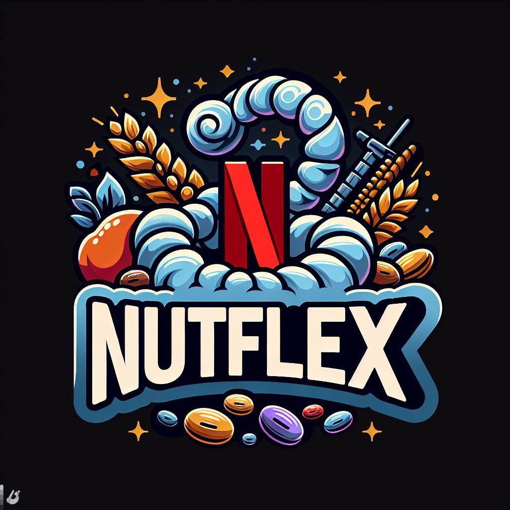
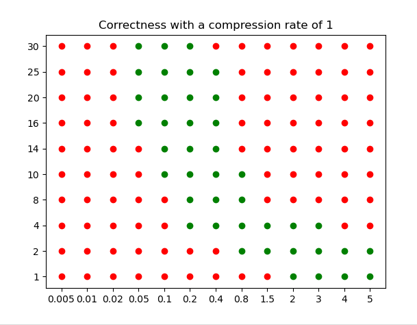
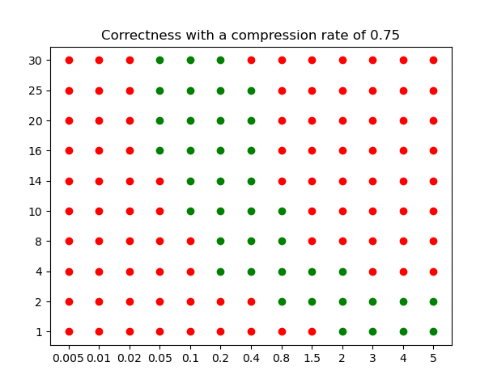
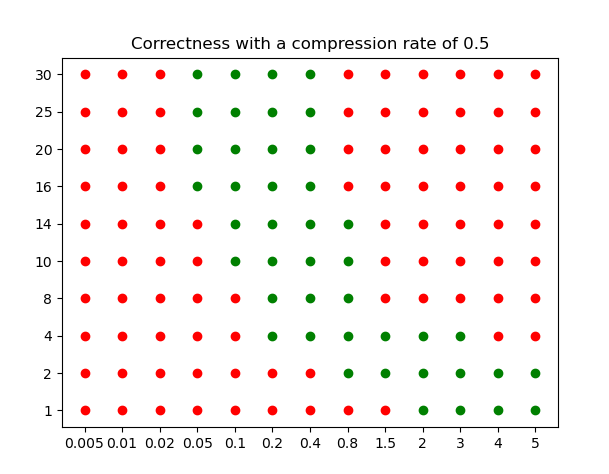
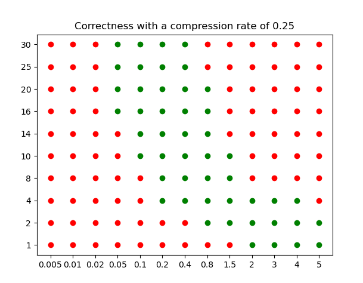
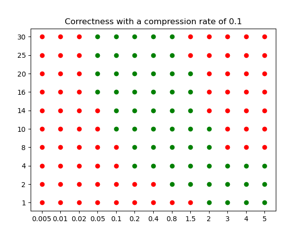
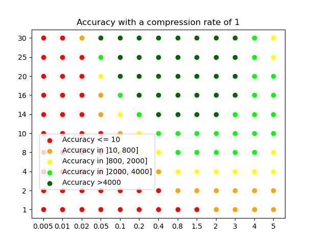
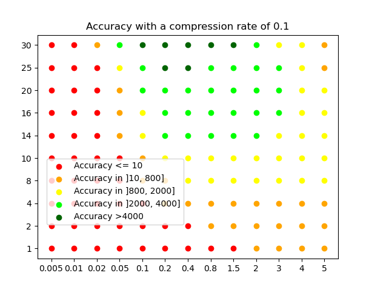

 Report on Nutflex Project
==========================
***Video watermarking in order to track movie piracy***

**Authors : Sharujan Mahalingasivam & Léo Durand-Köllner**



# Chosen Tools

## Python

We decided to use python for as the main programming language as there are already many libraries for video and data manipulation. Furthermore, even though the goal here was not to be speed efficient. The fact that these libraries were written in C makes our encoding and decoding scripts fast enough.

## External Libraries

### For the main script

The principal library we chose to use in this project is called `pyAV` which is python binding of the `FFmpeg` tool. This library is used for reading packets/frames from a video and for creating videos from frames.

We also needed to use `Pillow` for image manipulation.

And finally we used `Numpy` and `opencv` for data manipulation.

An excemptable library is `alive-progress` which we used to provide a progression visualisation when processing the watermarking.

### For the experimentations

In addition to the previously mentioned libraries, our experimentation methodology required `pytube` for downloading movie trailers from Youtube.

Moreover, we needed `moviepy` for video compression.

### For the analysis

We used `matplotlib` for data plotting.

## Chosen digital watermarking method

### Limited choices

In order to ensure some robustness, the two main watermarking methods we came with were spread spectrum and scalar quantification. We arbitrarily decided to go for watermarking by spread spectrum.

### How it works

The employed watermarking procedure works in two steps. First, two different samples are generated from a single movie : one called version "A" (or 0) and the other one called "B" (or 1). Then, the two separate versions are assembled into a single version, unique to the customer.

#### Generation of the samples

The spread spectrum watermarking encoding procedure we used works as follows :
 + First, choose a secret key $K$. Use this key as a seed for a PRNG.
 + Generate a random $n \times m$ matrix with coefficients in $\{-1,+1\}$, where $m$ is the size (in bits) of the message vector $d$ and $n$ is the size of the data vector $x$.
 + Compute the watermark as $w = \alpha (G \times d)$, where $\alpha$ is the strength of the watermark.
 + The final output is $y = x+w$.

In our specific case, the data is a frame from a movie. The method we opted for was to use an input vector $x$ corresponding to the middle square of the DCT of the frame (good compromise between resistance to attacks and low visual artefacts), characterized by a size $n_{DCT} \times n_{DCT}$. Moreover the watermarking is required to encode only a single bit, thus $m=1$.

The decoding procedure simply computes the correlation $c = G^T \times r$ where $r$ is the watermarked-attacked vector. In our case, we end up with a single bit.


#### A/B watermarking

Once the samples are generated, they can be concatenated at a fixed frequency $f$, determining the number of frames for each message bit. To read the customer ID, one simply needs to compute the average correlation on each time slot in order to recover the binary message.

# Implementation

## CLI Usage

The provided utility command-line interface is straightforward :
```
$ python main.py -h
usage: Nutflex [-h] [-k KEY] [-n N_DCT] [-i INPUT [INPUT ...]] [-o OUTPUT] [-t {0,1}] [-a ALPHA] [-m MESSAGE] [-f FREQUENCY] {w,e,d}

Watermark ID in video

positional arguments:
  {w,e,d}               w (watermark) e (encode using A/B scheme) d (decode)

options:
  -h, --help            show this help message and exit
  -k KEY, --key KEY
  -n N_DCT, --n-dct N_DCT
  -i INPUT [INPUT ...], --input INPUT [INPUT ...]
                        Input filename
  -o OUTPUT, --output OUTPUT
                        Output filename
  -t {0,1}, --type {0,1}
                        Type of watermarking
  -a ALPHA, --alpha ALPHA
                        Strength of the watermarking
  -m MESSAGE, --message MESSAGE
                        Message (ID) to hide
  -f FREQUENCY, --frequency FREQUENCY
                        Frequency of encoding
```

To generate the "A" watermark with secret key `42`, size of DCT square of `10` and $\alpha=4.0$:

```
$ python main.py w -t 0 -a 4.0 -k 42 -n 10 -i movies/matrix.mp4 -o matrix_0.mp4
|████████████████████████████████████████| 3489/3489 [100%] in 2:31.5 (23.02/s)
```

To encode the ID `69` at frequency $f=0.5$ bit/s :

```
$ python main.py e -m 69 -i matrix_0.mp4 matrix_1.mp4 -o matrix_id.mp4 -f 0.5
|████████████████████████████████████████| 3488/3488 [100%] in 19.7s (176.70/s)
```

Finally, to decode the message using the parameters $f=0.5, n_{DCT}=10$ and secret key `42`,

```
$ main.py d -k 42 -n 10 -i matrix_id.mp4 -f 0.5
|████████████████████████████████████████| 3486/3486 [100%] in 53.4s (65.33/s) 
000000000000000000000000000000000000000000000000000000000000001000101
```

## Project structure

Here is the file structure of the project : 

├── main.py **Main Script used for encoding and decoding**  
├── experiment.py **Script for Experimentation**  
├── analyse.py **Script for analysing the data obtained and plotting the graphs**  
├── requirements.txt **External modules required for the main script**  
├── movies **Folder containing the list of movie trailers and the trailers**  
│   ├── list.txt  
│   ├── trailer1.mp4  
│   ├── trailer2.mp4  
│   ├── trailer3.mp4  
│   ├...  
├── out **Folder generated by the experiment script containing the watermarked videos**  
│   ├── current_0.mp4  
│   ├── current_1.mp4  
│   ├── current_uncompressed.mp4  
│   ├...  
├── results **Folder generated by the experiment script containing the analysis data**  
│   ├── trailer1.mp4_data.txt  
│   ├── trailer2.mp4_data.txt  
│   ├── trailer3.mp4_data.txt  
│   ├...  
└──  

## Example

The values of $\alpha$ and $n_{DCT}$ need to be fine-tuned to provide both  robustness and comfortable user experience. Here is an example for $\alpha=0.1$ and $\alpha=4$ :


| $\alpha=0.1$ | $\alpha=4$ |
| -------- | -------- |
|  |  |


# Experimental methodology

Our goal was to measure various metrics for different triples of **alpha** (the watermark strength), **n_dct** (size of modified DCT square matrix) and **compression rate** (attack strength).

Here are the values of alpha tested : {0.005,0.01,0.02,0.05,0.1,0.2,0.4,0.8,1.5,2,3,4,5}

And the values of n_dct : {1,2,4,8,10,14,16,20,25,30}

The compression is done after encoding the message in order to simulate an attack.

Here are the compression factors considered {1, 0.75, 0.5, 0.25, 0.10} (1 means no compression, 0.1 means the bitrate has mean divided by 10)

The metrics of interest are : 
- Performance metrics : Encoding time, Decoding time
- Robustness metrics : Decoded Identifier, Confidence

We get metrics for **650** triples per trailer.

We wanted to get data on various high quality trailers. However, all this experimentation takes a lot of time to run, so we decided to only get the metrics for one trailer with a 360p quality which still required about 6 hours to run.


# Results

## Performance


## Absolute Correctness

First we check the absolute correctness for various values of alpha, n_dct and compression rate.
We simply check if the decoded message is exactly equal to the encoded message.

X-axis correspond to alpha values and Y-axis correspond to n_dct values.

Green dots correspond to (alpha, n_dct) that encoded and gave back the correct message.
 

 




As we can see, our method is quite robust, as the correctness is only slightly affected by the attacks.

It seems that for a given value of n_dct, only a given range of watermark strengh allows to get back the correct message. It should not be to low or too high.

## Accuracy

Now, we are going to analyze the accuracy of the decoding.

The accuracy is measured as the mean of the correlation when decoding. We use a color scale, based on this accuracy.

 

## 
